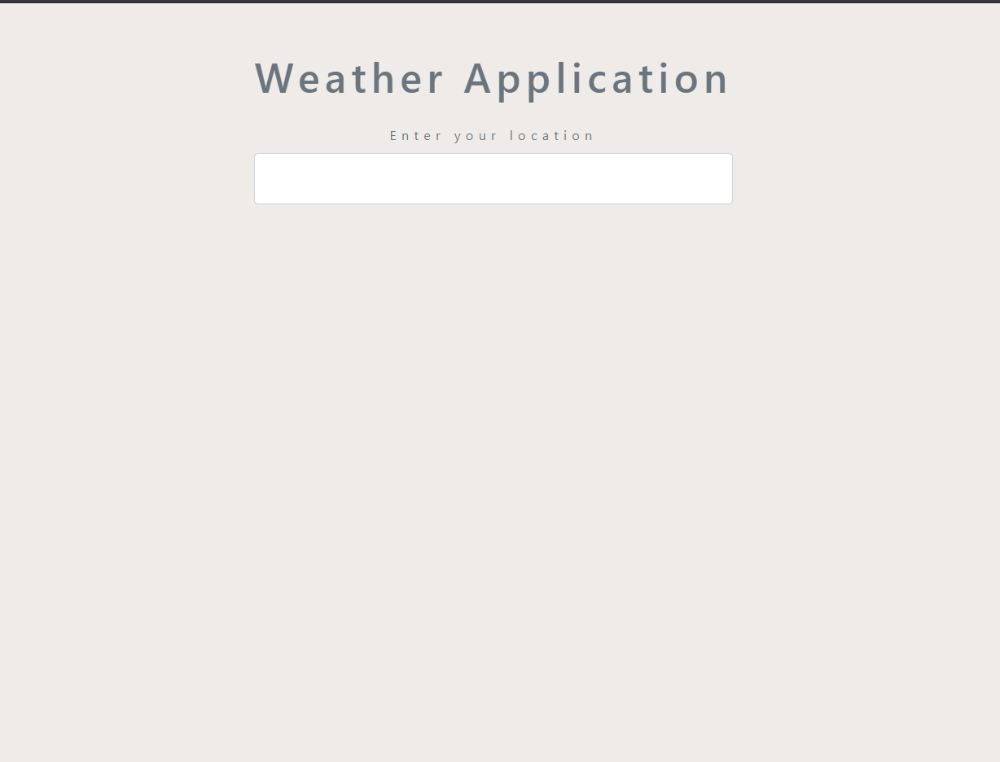
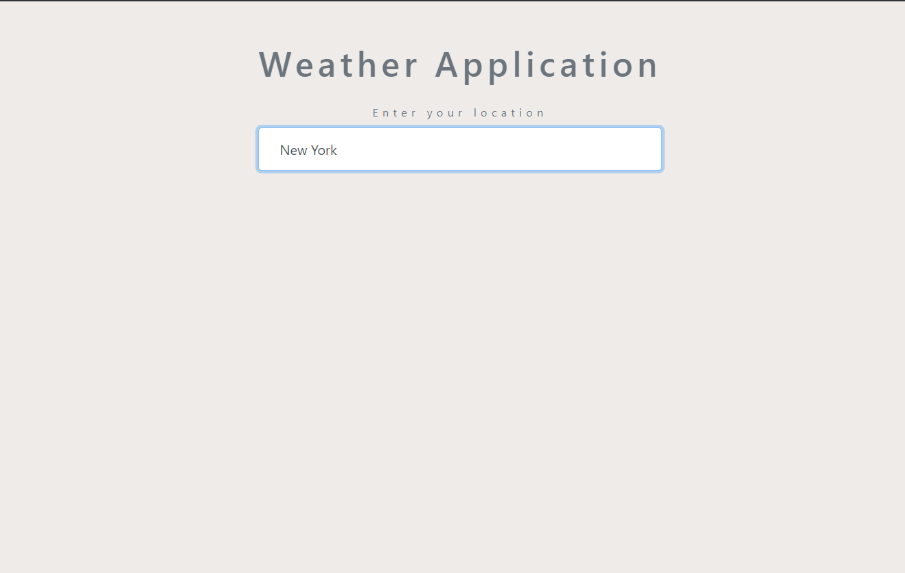
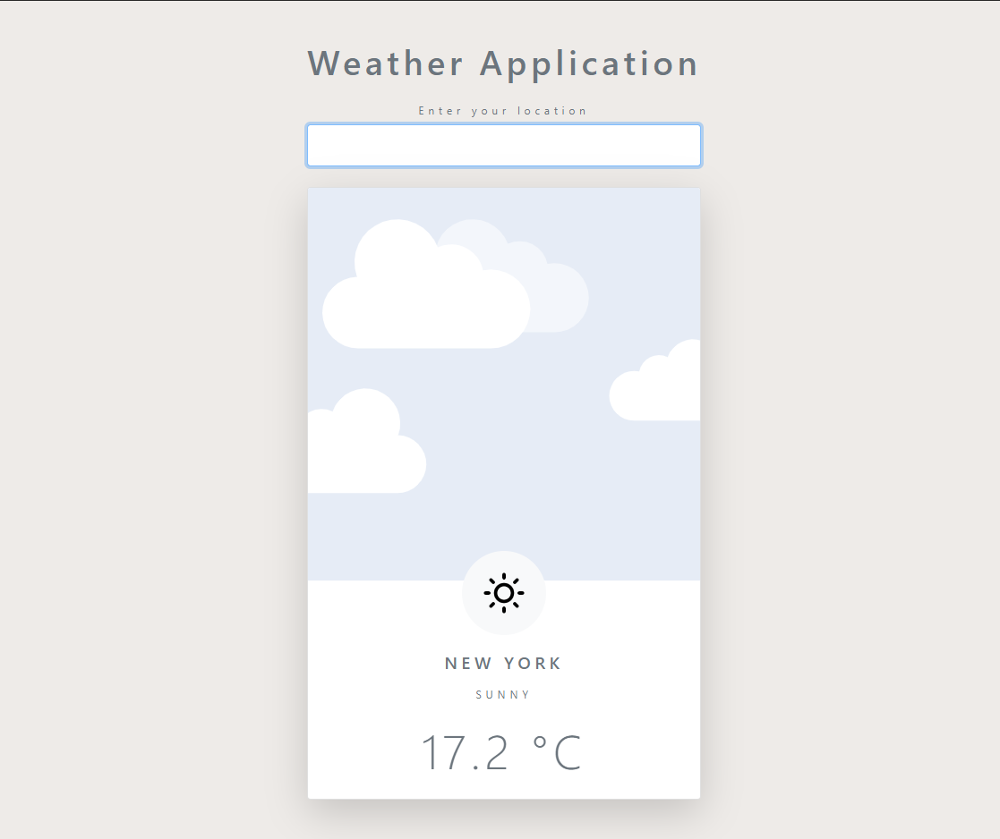

# Simple application which show you a weahter in place where you want to know.

### You have to write your favorite location in label and press enter.

### Then application show you the most important details like temprature and name of your city.

#### You could refresh or write new city in label and check weather in other place.

<ul>
    <li>Application has functionality which show you different icons and background images depends on weather.</li>
</ul>

### In this application I mostly use pure JavaScript, some HTML to create schema and little CSS to add some styles.

### For check information about weather I used to free API called developer.accuweather.com.

Use could use application download **zip-file** from my repository or simply **clone** from GitHub page.

### First look before you write in label your city.

### After wrote your location.

### There you see weather details, image and icon about your city.
